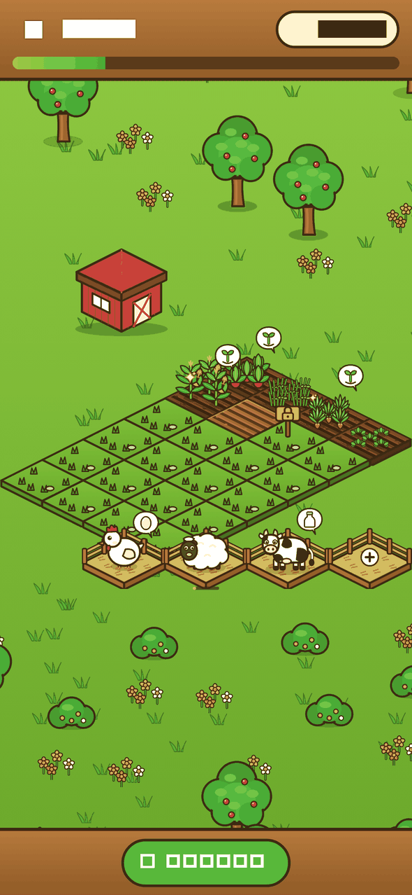

# Happy Farm

Клон «Счастливой фермы» (ВКонтакте, 2010-е) для iPhone.

- `server/` — сервер (Node 22, без зависимостей, SQLite). Запуск: `cd server && npm start`, тесты: `npm test`.
- `app/` — клиент на Flutter + Flame (iOS): вход, ферма, посадка, сбор, покупка грядок. Запуск на симуляторе: `cd app && flutter run --dart-define=API_URL=http://localhost:3000` (сервер должен быть запущен). Есть соседи, воровство урожая и животные (курица, овца, корова).

*Скриншот собран тестом `app/test/scene_test.dart` (шрифт в тестах заменён квадратами, на устройстве текст обычный). Вся графика оригинальная и генерируется кодом, см. `tools/sprites/README.md`.*

## API

`POST /register {name}` → `{token, farm}`; дальше заголовок `Authorization: Bearer <token>`.

| Метод | Путь | Описание |
|---|---|---|
| GET | `/catalog` | Список культур |
| GET | `/farm` | Моя ферма |
| POST | `/plant {plot, cropId}` | Посадить |
| POST | `/harvest {plot}` | Собрать урожай |
| POST | `/unlock-plot` | Купить новую грядку |
| GET | `/animal-catalog` | Список животных |
| POST | `/animals/buy {slot, kind}` | Купить животное в загон |
| POST | `/animals/collect {slot}` | Собрать продукт |
| GET/POST | `/friends` | Друзья / добавить `{name}` (дружба взаимная) |
| GET | `/friends/:id/farm` | Ферма друга |
| POST | `/friends/:id/steal {plot}` | Украсть у друга (по 10%, максимум 50% с грядки, один раз на вора) |

Время роста считается на сервере, клиенту доверять нельзя.
